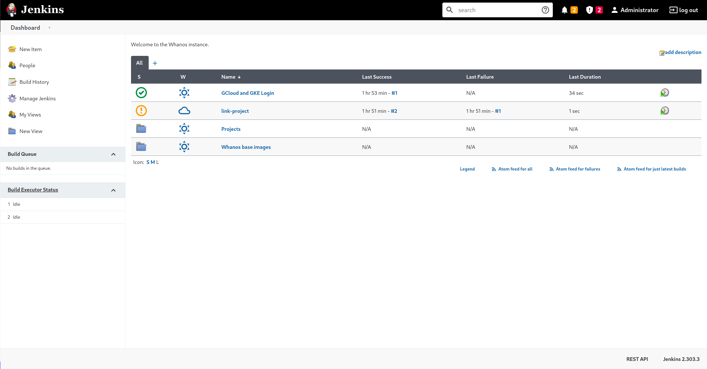
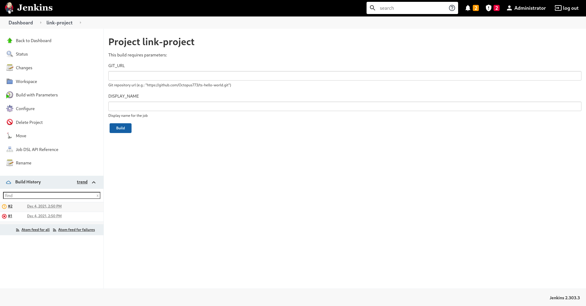

# Adding your git repository to the Whanos instance

Using the Whanos to build, dockerize and deploy your application automatically is a tremendous time saver that let you focus on your application.

## 1 — Access the Jenkins interface

Go to link-project and then go to the right the "Build with Parameters"

You have to provide to elements
 - `GIT_URL` this is the HTTP URL used to clone your repository (ex: https://github.com/Octopus773/ts-hello-world.git)
	**Note:** The GIT_URL has to publicly available 
 
 - `DISPLAY_NAME` this is the label to represent your project on the Whanos instance
	**Note:** The DISPLAY_NAME is unique in the Whanos instance
	The DISPLAY_NAME **only** supports lowercase ascii chars, numerics (0 to 9) and `-`n with a total length between 1 and 20 (bounds included)
	The text `must` be validated by the following regex `[a-z\d\-]{1,20}` in order to successfully setup the pipeline.

Once the project created you will find it under `Generated Items` in the project `link-project`

## 2 — Congrats, it's done

Now the Whanos will check your git repository every minute, if  you pushed under the minute Whanos will start the CI/CD pipeline.

If you want to deploy it without a push, you can manually trigger a pipeline by clicking `Build Now` at the right of your project in the Jenkins interface.