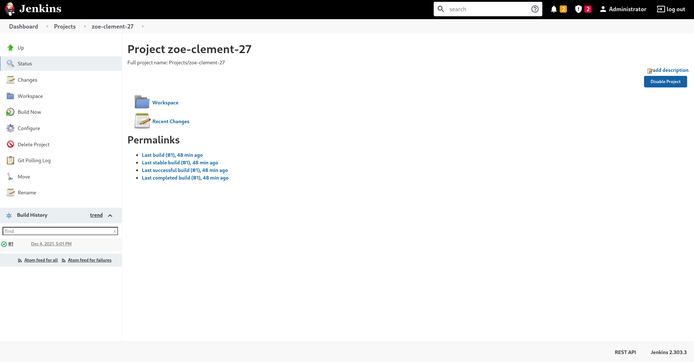

# Pipeline logging

Each time the pipeline builds, it generates a log

## 1 — Access the Jenkins interface



Go to the corresponding project on the right side, there's a list of all the previous builds and ongoing builds select your build and go to `Console Output`

Here you will see the complete trace generated by the build this where you can see the errors if your build has failed or the external IP if you requested a deployment

image 2

You have to provide to elements
 - `GIT_URL` this is the HTTP URL used to clone your repository (ex: https://github.com/Octopus773/ts-hello-world.git)
	**Note:** The GIT_URL has to publicly available 
 
 - `DISPLAY_NAME` this is the label to represent your project on the Whanos instance
	**Note:** The DISPLAY_NAME is unique in the Whanos instance
	The DISPLAY_NAME **only** supports lowercase ascii chars, numerics (0 to 9) and `-`
	The text `must` be validated by the following regex `[a-z\d\-]{0,20}`  in order to successfully setup the pipeline.

Once the project created you will find it under `Generated Items` in the project `link-project`

## 2 — Get your Deployment External IP

it's at the end of the logger

Now the Whanos will check your git repository every minute, if  you pushed under the minute Whanos will start the CI/CD pipeline.

If you want to deploy it without a push, you can manually trigger a pipeline by clicking `Build Now` at the right of your project in the Jenkins interface.

## 3 - Exemple

```
Started by an SCM change
Started by user [Administrator](http://localhost:8080/user/admin)
Running as SYSTEM
Building in workspace /var/jenkins_home/workspace/Projects/zoe-clement-27
The recommended git tool is: NONE
No credentials specified
Cloning the remote Git repository
Cloning repository [https://github.com/Octopus773/ts-hello-world.git](https://github.com/Octopus773/ts-hello-world.git)
 > git init /var/jenkins_home/workspace/Projects/zoe-clement-27 # timeout=10
Fetching upstream changes from [https://github.com/Octopus773/ts-hello-world.git](https://github.com/Octopus773/ts-hello-world.git)
 > git --version # timeout=10
 > git --version # 'git version 2.30.2'
 > git fetch --tags --force --progress -- [https://github.com/Octopus773/ts-hello-world.git](https://github.com/Octopus773/ts-hello-world.git) +refs/heads/*:refs/remotes/origin/* # timeout=10
 > git config remote.origin.url [https://github.com/Octopus773/ts-hello-world.git](https://github.com/Octopus773/ts-hello-world.git) # timeout=10
 > git config --add remote.origin.fetch +refs/heads/*:refs/remotes/origin/* # timeout=10
Avoid second fetch
Seen branch in repository origin/main
Seen 1 remote branch
 > git show-ref --tags -d # timeout=10
Checking out Revision 64d6534e2cb20805bcb85a579125b94c356ee6c1 (origin/main)
 > git config core.sparsecheckout # timeout=10
 > git checkout -f 64d6534e2cb20805bcb85a579125b94c356ee6c1 # timeout=10
Commit message: "2"
First time build. Skipping changelog.
[zoe-clement-27] $ /bin/sh -xe /tmp/jenkins15436770001186847745.sh
+ /jenkins/deploy.sh zoe-clement-27
javascript matched
Sending build context to Docker daemon  162.3kB

Step 1/4 : FROM whanos-javascript
# Executing 4 build triggers
 ---> Running in 8229f709cce6
Removing intermediate container 8229f709cce6
 ---> Running in 55eacc4df136
added 51 packages from 80 contributors and audited 51 packages in 1.689s
found 0 vulnerabilities

Removing intermediate container 55eacc4df136
 ---> Running in f75ffccb5385
Removing intermediate container f75ffccb5385
 ---> f998a84115b0
Step 2/4 : RUN npm install -g typescript@4.4.3
 ---> Running in 0d1794d30d25
/usr/local/bin/tsserver -> /usr/local/lib/node_modules/typescript/bin/tsserver
/usr/local/bin/tsc -> /usr/local/lib/node_modules/typescript/bin/tsc
+ typescript@4.4.3
added 1 package from 1 contributor in 2.359s
Removing intermediate container 0d1794d30d25
 ---> 23dd6883e685
Step 3/4 : RUN tsc
 ---> Running in 1173ceeed9ca
Removing intermediate container 1173ceeed9ca
 ---> c1d8e2f2d84e
Step 4/4 : RUN find . -name "*.ts" -type f -not -path "./node_modules/*" -delete
 ---> Running in 1a88ca757c53
Removing intermediate container 1a88ca757c53
 ---> bd93450b7612
Successfully built bd93450b7612
Successfully tagged europe-west1-docker.pkg.dev/plucky-agency-332314/whanos/whanos-zoe-clement-27-javascript:latest
Using default tag: latest
The push refers to repository [europe-west1-docker.pkg.dev/plucky-agency-332314/whanos/whanos-zoe-clement-27-javascript]
0da4187dae5b: Preparing
65339b2c4a02: Preparing
91ed6ba7651b: Preparing
184e0305df98: Preparing
9a419972c730: Preparing
532048288fcc: Preparing
30dd76952e8d: Preparing
1672d76d94c2: Preparing
1af2bec92d49: Preparing
9a5d14f9f550: Preparing
532048288fcc: Waiting
1af2bec92d49: Waiting
9a5d14f9f550: Waiting
30dd76952e8d: Waiting
0da4187dae5b: Pushed
9a419972c730: Pushed
65339b2c4a02: Pushed
184e0305df98: Pushed
30dd76952e8d: Pushed
532048288fcc: Pushed
1672d76d94c2: Pushed
91ed6ba7651b: Pushed
9a5d14f9f550: Pushed
1af2bec92d49: Pushed
latest: digest: sha256:f155395a431c92051abcbc86747154ae0f76d3b03fafaf2b35df7c647f1eb010 size: 2414
Release "zoe-clement-27" does not exist. Installing it now.
NAME: zoe-clement-27
LAST DEPLOYED: Sat Dec  4 17:01:31 2021
NAMESPACE: default
STATUS: deployed
REVISION: 1
TEST SUITE: None
Trying to get the external IP:
.........
xx.xx.xxx.xxx
Finished: SUCCESS
```